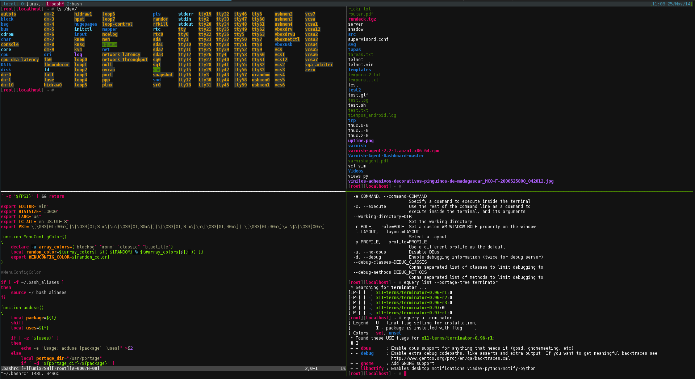

terminator-molokai
==================

## Description

Molokai theme for terminator

## Instructions

Simply replace your ~/config/terminator/config with my config. Then, select in your terminator the 'molokai' profile, or run it as 'terminator -p molokai'.

If you want, you can delete all the [[default]] section and rename the [[molokai]] as [[default]].

## Screenshots

